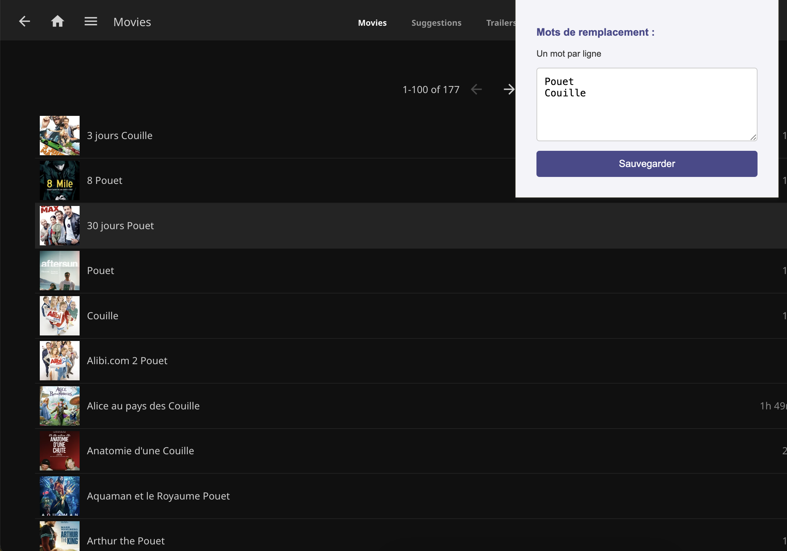

# JellyFin Title Modifier

## Description

JellyFin Title Modifier is a Chrome extension that replaces words in the titles of movies and series on JellyFin. You can configure multiple replacement words, and the extension will randomly choose one to replace words in the titles. If a title contains a colon (`:`), it will replace a word on both sides of the colon with different words.

## Example



In this example, all titles have been modified with the word "couille".

## Features

- Replace the last word in movie and series titles
- Configure multiple replacement words through the extension popup
- Special handling for different title formats:
  - For titles with numbers: adds the word after the number
  - For titles with colons: replaces words on both sides with different words
- Works in both grid and list views

## Installation

1. **Clone the Repository:**

   ```bash
   git clone https://github.com/yourusername/jellyfin-title-modifier.git
   ```

2. **Open Chrome Extensions Page:**

   Go to `chrome://extensions/` in your Chrome browser.

3. **Enable Developer Mode:**

   Toggle the "Developer mode" switch in the top right corner.

4. **Load Unpacked Extension:**

   Click on "Load unpacked" and select the folder where you cloned the repository.

5. **Configure Replacement Words:**

   - Click on the extension icon in the Chrome toolbar
   - Enter your replacement words (one per line) in the popup
   - Click "Save" to store your words

## Usage

1. Navigate to your JellyFin instance
2. The extension will automatically modify titles according to these rules:
   - Regular titles: last word is replaced
   - Titles ending with numbers: word is added after the number
   - Titles with colons: last word of each part is replaced with different words

## Examples

- "Avatar" → "Avatar Pouet"
- "Fast and Furious" → "Fast and Couille"
- "Star Wars: A New Hope" → "Star Pouet : A New Couille"
- "Fast 5" → "Fast 5 Pouet"

## Contributing

Feel free to submit issues or pull requests if you have suggestions or improvements.

## License

This project is licensed under the MIT License.